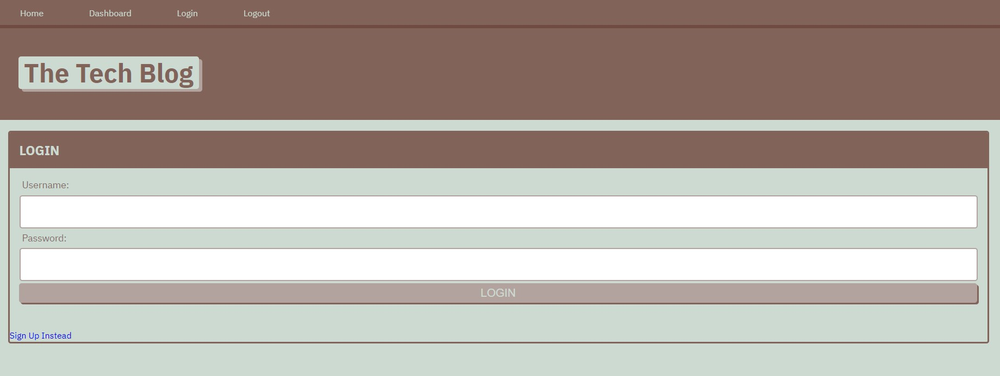

# MVC-Tech-Blog


## Table of Contents

- [Description](#description)
- [Installation](#installation)
- [Usage](#usage)
- [License](#license)

## Description

A mysql database and CMS-style Blog built using Model View Controller (MVC) paradigm. Built using MySQL2, Express, Sequelize, Bulma, Handlebars and dotenv

[Click the link for the live heroku app](https://guarded-dawn-45933.herokuapp.com/login)

This application should meet the following criteria:

```
GIVEN a CMS-style blog site
WHEN I visit the site for the first time
THEN I am presented with the homepage, which includes existing blog posts if any have been posted; navigation links for the homepage and the dashboard; and the option to log in
WHEN I click on the homepage option
THEN I am taken to the homepage
WHEN I click on any other links in the navigation
THEN I am prompted to either sign up or sign in
WHEN I choose to sign up
THEN I am prompted to create a username and password
WHEN I click on the sign-up button
THEN my user credentials are saved and I am logged into the site
WHEN I revisit the site at a later time and choose to sign in
THEN I am prompted to enter my username and password
WHEN I am signed in to the site
THEN I see navigation links for the homepage, the dashboard, and the option to log out
WHEN I click on the homepage option in the navigation
THEN I am taken to the homepage and presented with existing blog posts that include the post title and the date created
WHEN I click on an existing blog post
THEN I am presented with the post title, contents, post creator’s username, and date created for that post and have the option to leave a comment
WHEN I enter a comment and click on the submit button while signed in
THEN the comment is saved and the post is updated to display the comment, the comment creator’s username, and the date created
WHEN I click on the dashboard option in the navigation
THEN I am taken to the dashboard and presented with any blog posts I have already created and the option to add a new blog post
WHEN I click on the button to add a new blog post
THEN I am prompted to enter both a title and contents for my blog post
WHEN I click on the button to create a new blog post
THEN the title and contents of my post are saved and I am taken back to an updated dashboard with my new blog post
WHEN I click on one of my existing posts in the dashboard
THEN I am able to delete or update my post and taken back to an updated dashboard
WHEN I click on the logout option in the navigation
THEN I am signed out of the site
WHEN I am idle on the site for more than a set time
THEN I am able to view comments but I am prompted to log in again before I can add, update, or delete comments
```

## Installation

Node.js, NPM, and MySql must be installed on your computer. <br />
<br />Navigate to directory you wish to save the clone to. <br />
`git clone git@github.com:Tikimaniac77/MVC-Tech-Blog.git` <br />
<br />Use npm install to install dependecies. <br />
`npm install` <br />
<br />Log into MySQL. <br />
`mysql -u <user> -p ` <br />
Enter password. <br />
<br />Source the schema. <br />
`source db/schema.sql` <br />
<br />Quit MySQL and seed the database. <br />
`quit`
`npm run seed`
<br />Start the server. <br />
`npm start`

## Usage

Create your account by using the Sign up Instead link.

Make a post. see existing posts and add comments. or Edit/delete your existing posts.



## License

This project is licensed under the MIT License.
